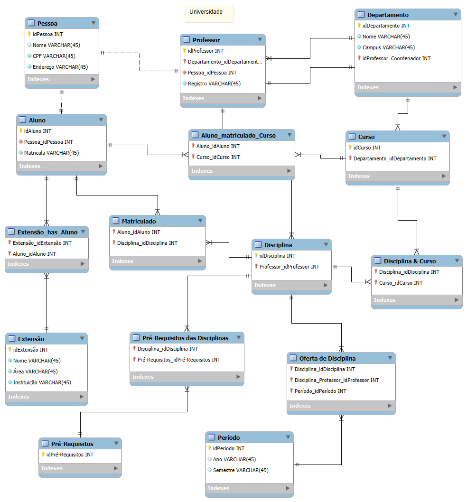

# Sistema Acadêmico - Modelo ER

Este repositório contém o modelo de banco de dados desenvolvido para um sistema acadêmico. Ele foi criado utilizando o MySQL Workbench como parte do aprendizado sobre modelagem de banco de dados.

---

## 📊 Diagrama ER

O diagrama acima representa as entidades e relacionamentos para um sistema acadêmico, incluindo Alunos, Cursos, Professores e Disciplinas.

---

## 📝 Escopo do Projeto

### Alunos
- Estudantes podem estar matriculados em mais de um curso ao mesmo tempo.
- Realizam atividades complementares (internas ou externas) para cumprir horas obrigatórias.

### Disciplinas
- Podem ser compartilhadas entre diferentes cursos.
- Possuem ciclo de vida semestral.
- Algumas disciplinas têm pré-requisitos.

### Professores
- Ministram disciplinas específicas.
- Estão associados às coordenações de seus respectivos cursos.

---

## 🛠️ Tecnologias Utilizadas
- **MySQL Workbench**: Para criação do modelo conceitual.
- **MySQL**: Para implementação do banco de dados.

---

## 📂 Arquivos no Repositório

- `diagrama.mwb`: Arquivo original do MySQL Workbench contendo a modelagem.
- `diagrama.png`: Imagem do diagrama ER exportada.

---

## 🖥️ Como Visualizar o Projeto

1. Faça o download do arquivo `diagrama.mwb`.
2. Abra o arquivo no MySQL Workbench para explorar o modelo em detalhes.

---

## 📚 Aprendizados

Durante a criação deste projeto, foram abordados conceitos como:
- Modelagem ER (Entidade-Relacionamento).
- Identificação de entidades e atributos.
- Regras de cardinalidade e dependências entre entidades.

---

## 🤝 Contribuições

Contribuições são bem-vindas! Se você tiver sugestões ou encontrar problemas no modelo, sinta-se à vontade para criar uma *issue* ou um *pull request*.

---

## ⚖️ Licença

Este projeto está licenciado sob a MIT License.
